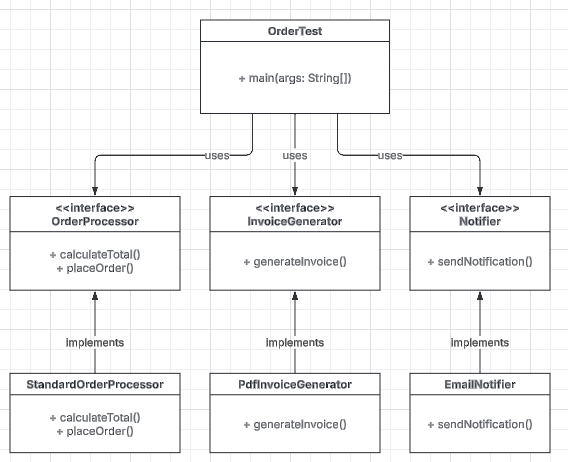

# Lab-Assignment-5-SOLID-Principles

Refer to the code below

* You must provide the description of the problem and the UML Class Diagram solution in readMe file.
* Include all the codes in your gitHub repository.
* Submit the link of your solution written in your gitHub repository

## Improve the following codes to implement SOLID principles in OOP

public interface Order {

  void calculateTotal(double price, int quantity);

  void placeOrder(String customerName, String address);

  void generateInvoice(String fileName);

  void sendEmailNotification(String email);
}

public class OrderAction implements Order {

  @Override
  public void calculateTotal(double price, int quantity) {
    double total = price * quantity;
    System.out.println("Order total: $" + total);
  }

  @Override
  public void placeOrder(String customerName, String address) {
    // Simulate placing order in a system
    System.out.println("Order placed for " + customerName + " at " + address);
  }

  @Override
  public void generateInvoice(String fileName) {
    // Simulate generating invoice file
    System.out.println("Invoice generated: " + fileName);
  }

  @Override
  public void sendEmailNotification(String email) {
    // Simulate sending email notification
    System.out.println("Email notification sent to: " + email);
  }
}

public class OrderTest {

  public static void main(String[] args) {
    Order order = new OrderAction();
    order.calculateTotal(10.0, 2);
    order.placeOrder("John Doe", "123 Main St");

    // These methods might not be needed for all orders
    order.generateInvoice("order_123.pdf");
    order.sendEmailNotification("johndoe@example.com");

}
}

## Problem Description

The original system featured a single, monolithic `Order` interface that contained methods for calculating totals, placing orders, generating invoices, and sending email notifications.

This design violated two key SOLID principles:

1. **Single Responsibility Principle (SRP):** The implementing class (`OrderAction`) was responsible for multiple unrelated tasks (math calculations, file generation, and email communications). Any change to how emails are sent or how invoices are generated would force a change in this core class.
2. **Interface Segregation Principle (ISP):** By grouping all these actions into one `Order` interface, the system forced any new order types to implement methods they might not need (e.g., forcing a simple order to implement `generateInvoice` even if no invoice is required).

## Solution

We refactored the code by breaking the "fat" interface into smaller, highly-cohesive interfaces (`OrderProcessor`, `InvoiceGenerator`, and `Notifier`). We then created specific classes that handle one single responsibility each. This makes the system modular, easier to test, and flexible for future additions (like adding an `SmsNotifier` without altering existing code).

## UML Class Diagram Solution

Here is the UML diagram representing the refactored, SOLID-compliant structure:

